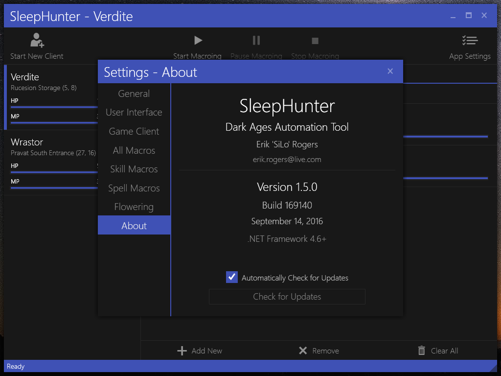

# SleepHunter

Dark Ages Automation Tool

**Disclaimer: Much of the code here does not follow proper MVVM conventions or project structure.**

## Requirements
- [Dark Ages](http://www.darkages.com) Client 7.41
- [.NET Framework 4.8.1](https://dotnet.microsoft.com/en-us/download/dotnet-framework/net481) (or newer)

