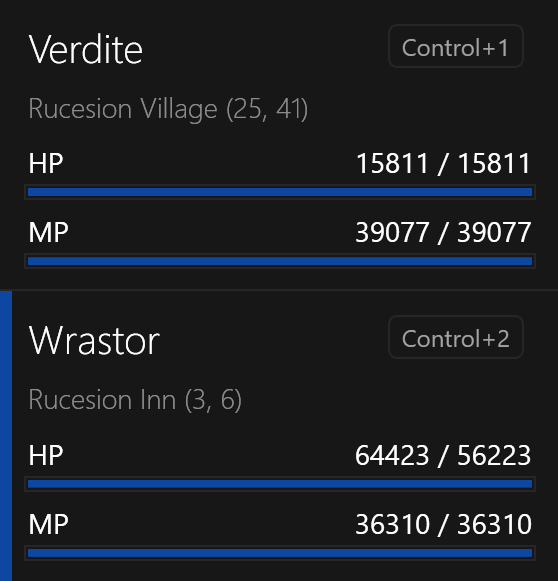

# Character List

Shows information about the character, including current location, health, mana, and activity status (when macroing).
The selected character will be displayed with a highlighted indicator on the left side of the list item.

The main window title will also display the name of the selected character.

The status bar shows `Healthy` on the left for a successful selected-client
runtime capture. Capture, observation, and automation failures appear there in
red. Expected map-transition waits appear as a neutral status. Use the details
button on the right to inspect rolling average, minimum, and maximum
snapshot-read times from the last 256 captures, captured vitals,
memory-read totals, nested error context, and retained errors. The details
panel is aligned to the bottom-right within the window content. It holds a
snapshot while open so the diagnostic text remains selectable and can be
copied with `Ctrl+C`.

## Quick Select

Double-clicking on a character will bring that Dark Ages game client window to the foreground.
This is useful when you are trying to find that particular game client window that is hidden behind other windows.

## Hotkey Binding
You can also bind a hotkey combination to a character by selecting the character and pressing the hotkey combination (ex: `Ctrl+1`).
This acts as a global hotkey that toggles start, pause, and resume for that
character even when SleepHunter is not the active window. It acts on the
character that owns the hotkey, regardless of the current selection.

If a hotkey is bound to a character, the hotkey combination will be displayed in the character window.
You can unbind a hotkey by selecting the character and pressing the `Delete` or `Backspace` key.

## Character Sorting

By default, characters are sorted by launch order, using each game client
process start time from oldest to newest.
This sorting can be modified in the [User Interface Settings](../settings/user-interface.md) window.
