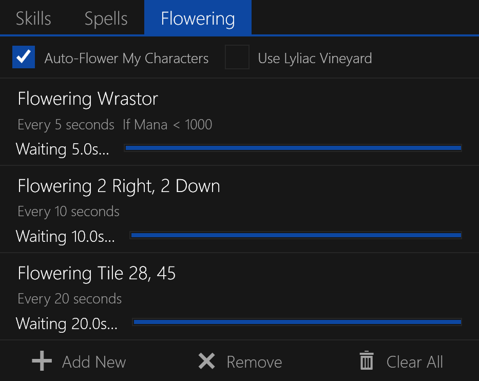

# Flowering Tab

Shows the targets for casting `Lyliac Plant` and option to enable `Lyliac Vineyard` (if available).

The user-selected flower target in the queue will have a left-side highlight indicator.

**NOTE:** The `Flowering` tab is only available if the `Lyliac Plant` or `Lyliac Vineyard` spells are available.

## Queueing Flower Targets

The `Add New` button at the bottom will bring up the `Flower Target` dialog for flowering.
This dialog allows you to select a target for the spell and add it to the `Flower Queue`.

The `Flower Queue` is the list contained in the `Flowering` tab itself.
Here all targets for `Lyliac Planet` will be displayed, with the condition set as well as a countdown timer.

For more information about the `Flower Target` dialog, see the sidebar.

## Modifying Flower Targets

Double-clicking a flower target will bring up the `Flower Target` dialog for modifying the cast target.
You can re-arrange the order of the targets by dragging and dropping them.

## Flowering Timer

While the character macro is running, the timer will tick down and show the remaining time.
When the timer reaches zero, the target will be flowered (when possible), and timer reset.

## Removing Flower Targets

Targets can be removed from the queue by clicking the `Remove` or `Clear All` buttons at the bottom.
Alternatively, you can select a target and press the `Delete` or `Backspace` key.

## Additional Settings

Additional settings for the `Flowering` tab can be found in the [Flowering Settings](../settings/flowering.md) window.
