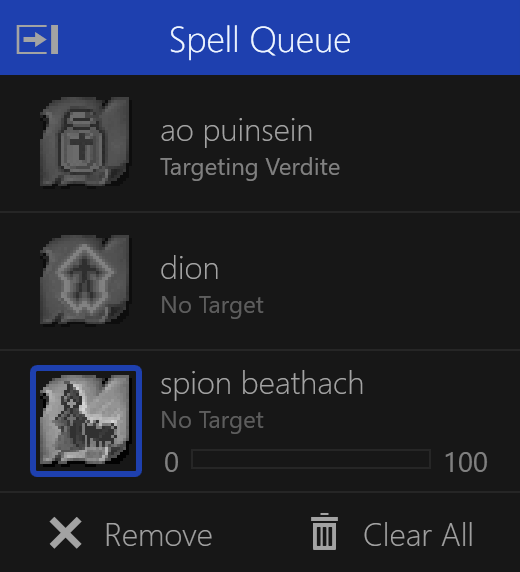

# Spell Queue

Shows the queued targets for casting spells.

The user-selected spell in the queue will have a left-side highlight indicator.
While being cast, the spell will be highlighted white and a thick border will be displayed around the spell.

## Progress Display

If set to only cast to a maximum level, the progress bar will be displayed.
Once the spell reaches the maximum level desired, it will be ignored while in the queue.

## Modifying Spell Targets

Double-clicking a spell will bring up the `Spell Target` dialog for modifying the cast target.
You can re-arrange the order of the targets by dragging and dropping them.

## Removing Spell Targets

Targets can be removed from the queue by clicking the `Remove` or `Clear All` buttons at the bottom.
Alternatively, you can select a target and press the `Delete` or `Backspace` key.

## Show/Hide Spell Queue

The Spell Queue visibility can be toggled using the show/hide button.
It will be shown when adding a new spell target for a character.
