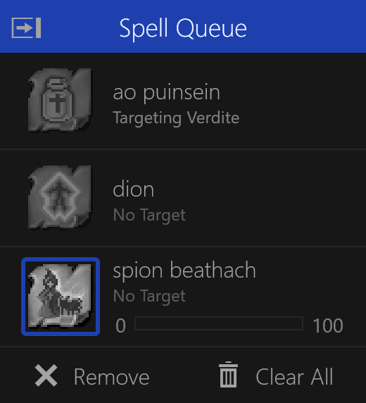

# Spell Queue

Shows the queued targets for casting spells.

The user-selected spell in the queue will have a left-side highlight indicator.
Spell names remain white, and the spell being prepared or cast receives the same highlighted icon treatment as an enabled skill.

## Spell Rotation

Each character can have their own spell queue rotation mode set in the `Spell Queue`.
This setting is preserved with their macro state when saved.
If a macro does not store a character-specific mode, the mode from [Spell Macro Settings](../settings/spell-macros.md) is used.

| Mode | Selection behavior | When the next row is considered |
| --- | --- | --- |
| `No Rotation` | Treats the queue as a top-down priority list and selects the first ready spell on every cast. | Rows that have reached their target level or are temporarily unavailable are passed over. If cooldown skipping is disabled, a cooling spell blocks lower-priority rows. |
| `Singular Order` | Keeps selecting the current spell rather than rotating after each cast. | It advances after the current entry reaches its target level or is no longer available. A spell without a target level remains current indefinitely. Temporary mana, health, or cooldown conditions make this mode wait on the current entry. |
| `Round Robin` | Starts with the row after the last successfully issued cast and wraps at the bottom. | It advances after every issued cast. Temporarily unavailable rows can be passed over, including cooling spells when cooldown skipping is enabled. |

In short, use `No Rotation` when the top rows should always have priority, `Singular Order` when one spell should be trained to completion before the next, and `Round Robin` when ready spells should take turns.

## Progress Display

If set to only cast to a maximum level, the progress bar will be displayed.
Once the spell reaches the maximum level desired, it will be ignored while in the queue.

## Modifying Spell Targets

Double-clicking a spell will bring up the `Spell Target` dialog for modifying the cast target.
You can re-arrange the order of the targets by dragging and dropping them.
Spells can be added, edited, reordered, or removed while the macro is running.
Each completed change is applied to the runtime without stopping or pausing it.

Changing the rotation mode or queue order does not interrupt a spell that is already being cast.
The next spell selection uses the latest complete mode and ordering.
A live rotation or ordering change starts selection from the first row of the updated queue, after which the selected rotation mode controls subsequent casts.

## Removing Spell Targets

Targets can be removed from the queue by clicking the `Remove` or `Clear All` buttons at the bottom.
Alternatively, you can select a target and press the `Delete` or `Backspace` key.

## Show/Hide Spell Queue

The Spell Queue visibility can be toggled using the show/hide button.
It will be shown when adding a new spell target for a character.

## Additional Settings

Additional settings for the `Spell Queue` can be found in the [Spell Macros Settings](../settings/spell-macros.md) window.
