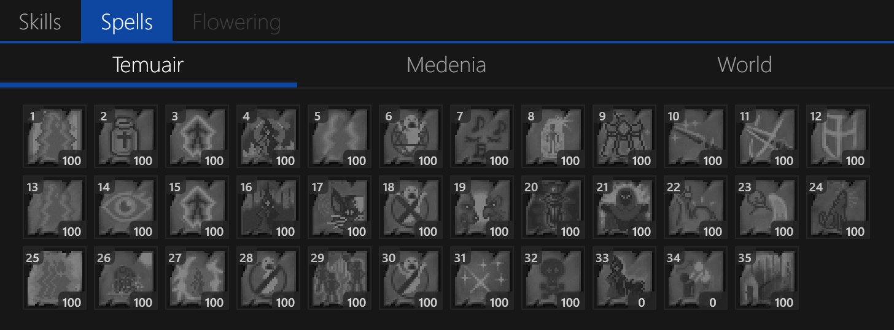

# Spells Tab

Spells are arranged as a grid of icon buttons similar to the game client, displaying the current level of the spell and the cooldown status (if on cooldown).

## Spell Organization

Spells are organized into 3 tabs:

- `Temuair` - spells learned from your original class path
- `Medenia` - spells learned from your Medenian class path
- `World` - spells learned for world-related activities (`nis`, etc.)

## Queueing Spells

Double-clicking a spell will bring up the [Spell Target](./spell-target.md) dialog for that casting spell.
This dialog allows you to select a target for the spell and add it to the [Spell Queue](#spell-queue).

When a spell is being cast, it will be highlighted white and a thick border will be displayed around the spell icon.

## Grid Layout

By default, spells are arranged with 12 spells per row.
You can change the number of spells displayed per row in the [Settings](../settings.md) window.

## Tooltip Help

You can mouse over a spell to see the tooltip for that spell.
