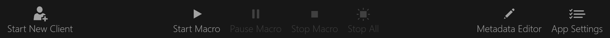

# Toolbar

The toolbar has the following buttons:

- [Launch Client](#launch-client)
- [Load State](#load-state)
- [Save State](#save-state)
- [Start Macro](#start-macro)
- [Pause Macro](#pause-macro)
- [Stop Macro](#stop-macro)
- [Stop All](#stop-all)
- [Metadata Editor](#metadata-editor)
- [App Settings](#app-settings).

## Launch Client

This button will launch a new game client, applying any tweaks that are enabled in the [Settings](./settings.md#game-client) window.

By default, game clients that are not actively "logged in" will **not** be displayed in the list.

## Load State

This button will open a dialog to manually open the current character's state from a file.

**NOTE:** Any skills/spells that are not available on the character will be ignored and not added to the queue.

## Save State

This button will open a dialog to manually save the current character's state to a file.

## Start Macro

This button will start macroing the selected character, performing any actions that they have queued.
If paused, this will resume macroing the selected character.

## Pause Macro

This button will pause macroing the selected character, retaining the current state of the macro.

## Stop Macro

This button will stop macroing the selected character, resetting the macro state.

## Stop All

This button will stop macroing on all characters, resetting the macro state.
It is equivalent to clicking the `Stop Macro` button for each character.

### Pause vs Stop Macro

The main difference between `Pause Macro` and `Stop Macro` is that pause acts as a temporary stop, while stop will reset the macro state for that character.
You can notice this with certain timers like flower targets when you pause/resume versus stopping and re-starting.

**NOTE:** This does **not** mean that your skills and spells will be removed from the queue, only that the macro state will be reset.

## Metadata Editor

This button will open the [Metadata Editor](./metadata-editor.md) window.

## App Settings

This button will open the [Settings](../settings/general.md) window.
