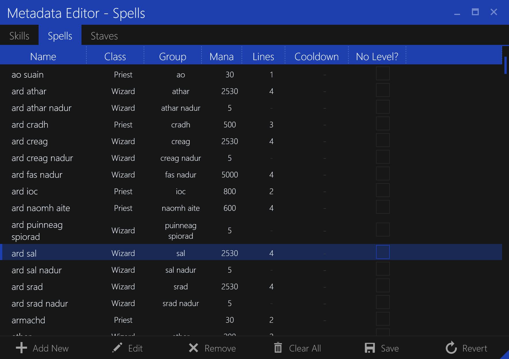

# Spells Editor

The `Spells` tab in the `Metadata Editor` allows you to edit the database of known spells.
This allows SleepHunter to recognize spells and configure behaviors when using them.

### Adding a New Spell

To add a new spell, click the `Add` button in the bottom bar. You will be prompted to enter the spell information.

### Editing a Spell

To edit a spell, double-click the spell in the list or select it and click the `Edit` button in the bottom bar.
You will be prompted to enter the spell information, similar to the `Add Spell` dialog.

### Removing a Spell

To remove a spell, select it and click the `Remove` button in the bottom bar.

### Clearing All Spells

To clear all spells, click the `Clear All` button in the bottom bar.

### Save Changes

Save all changes to the database file. This will overwrite the existing file.

### Revert Changes

Discard all changes and revert to the last saved state (from file).

## Add/Edit Spell Dialog

The `Spell` dialog allows you to enter the information for a spell, either for adding a new spell or editing an existing one.

### Spell Name

The name of the spell. This is the name that will be displayed in the UI.

### Group Name

The group name of the spell, used for categorizing spells for certain interactions like staff-switching.

### Mana Cost

The mana cost of the spell, in MP.

### Cast Time

The cast time of the spell, in lines. Each line is about one second.

### Cooldown

The cooldown of the spell, in seconds (if applicable). A zero-cool down means the spell has no cooldown.

### Does Not Level

Whether the spell does not increase on level. If this is set the spell level will not be displayed in the UI.

### Character Class

The character classes that can use the spell.

**NOTE:** This is currently unused but may be used in the future for certain behaviors.
