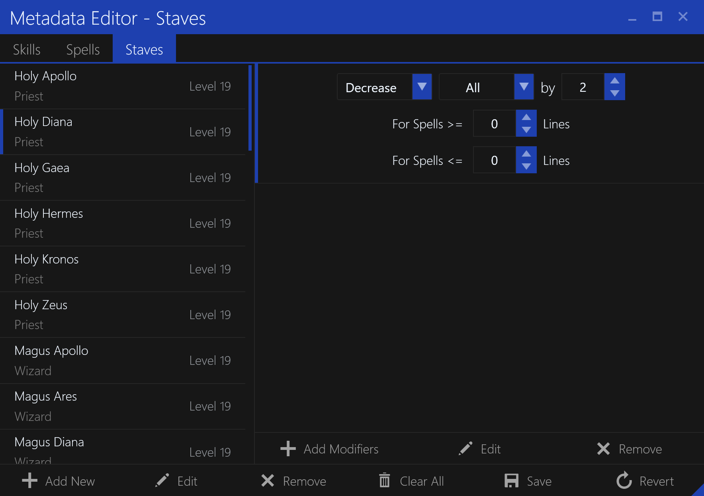
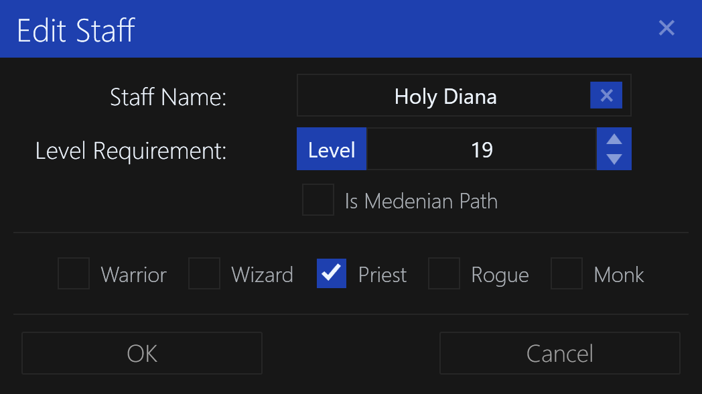

# Staves Editor

The `Staves` tab in the `Metadata Editor` allows you to edit the database of known staves and their modifiers.
This allows SleepHunter to recognize staves and configure behaviors when using them.

### Adding a New Staff

To add a new staff, click the `Add` button in the bottom bar. You will be prompted to enter the staff information.

### Editing a Staff

To edit a staff, double-click the staff in the list or select it and click the `Edit` button in the bottom bar.
You will be prompted to enter the staff information, similar to the `Add Staff` dialog.

### Removing a Staff

To remove a staff, select it and click the `Remove` button in the bottom bar.

### Clearing All Staffs

To clear all staffs, click the `Clear All` button in the bottom bar.

### Save Changes

Save all changes to the database file. This will overwrite the existing file.

### Revert Changes

Discard all changes and revert to the last saved state (from file).

## Add/Edit Staff Dialog

The `Staff` dialog allows you to enter the information for a staff, either for adding a new staff or editing an existing one.

### Staff Name

The name of the staff. This is the name that will be displayed in the UI.

### Level Requirement

The level requirement of the staff for the character to use it.

### Is Medenian Path

Whether the staff requires a character to be a Medenian class to use it.

### Character Class

The character classes that can use the staff.

**NOTE:** This is currently unused but may be used in the future for certain behaviors.

## Add/Edit Staff Modifiers Dialog

The `Staff Modifiers` dialog allows you to enter the modifiers for a staff, mostly for spell lines.

### Action

The type of modification of spell lines. Can be `Increase`, `Descrease` or `Set`.

### Scope

The scope of the modification. Can be `All`, `Single` or `Group`. This is where the `Group Name` comes in for spells.

### Scope Name

The name of the scope. This is the name of the spell or group of spells to modify, only when `Scope` is set to `Group`.
For example, the `Holy Hermes` only affects spells in the `ioc` group.

### Value

The value of the modification. This is the amount of lines to increase, decrease or set the spell line to.

### Minimum Lines

The minimum number (inclusive) of lines for the spell to be in order to be affected by the modification.
Zero means the spell will always be affected.

Foe example the `Holy Gaea` only affects spells with 4 or more lines.

### Maximum Lines

The maximum number (inclusive) of lines for the spell to be in order to be affected by the modification.
Zero means the spell will always be affected.

For example the `Holy Kronos` only affects spells that are 2 lines.
