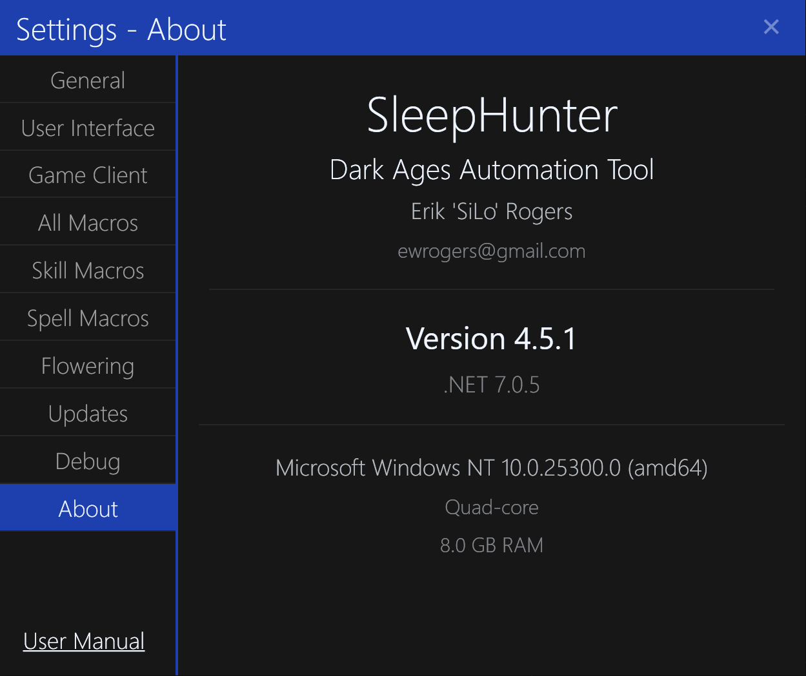

# About SleepHunter

The `About` settings tab contains information about the application, author, and computer.

## Application Version

Displays the current version of the application.

## Framework Version

Displays the current version of .NET used by the application.

## OS Version

Displays the current version of the operating system, including CPU architecture.

## System Specs

Displays the current system specifications, including CPU cores and installed RAM.