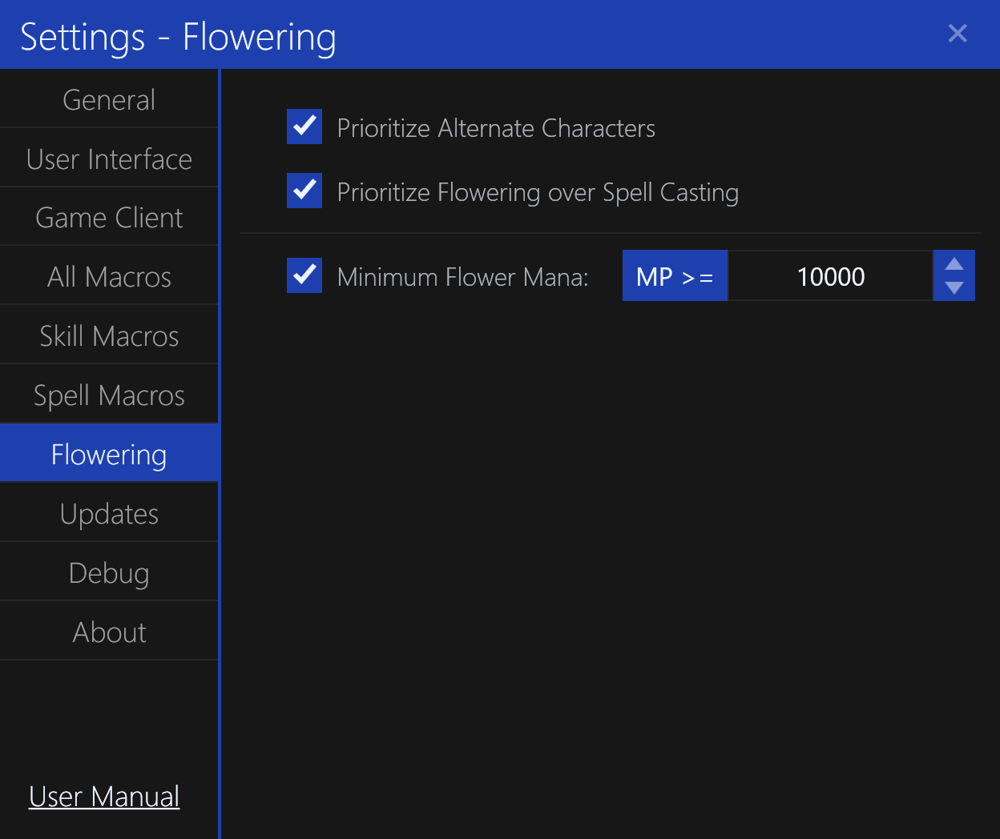

# Flowering Settings

The `Flowering` settings tab contains settings for the casting `Lyliac Plant` (flower) spell on others.

## Prioritize Alternate Characters

This setting determines whether the application will prioritize casting the `Lyliac Plant` spell on alternate characters over other target types.
By default, this is `Enabled`.

## Prioritize Flowering over Spell Casting

This setting determines whether the application will prioritize casting the `Lyliac Plant` spell over other spell casting macros.
By default, this is `Enabled`.

## Minimum Flower Mana

This setting determines the minimum mana required to cast the `Lyliac Plant` spell.
By default, this is `10000` but can be decreased as necessary.
