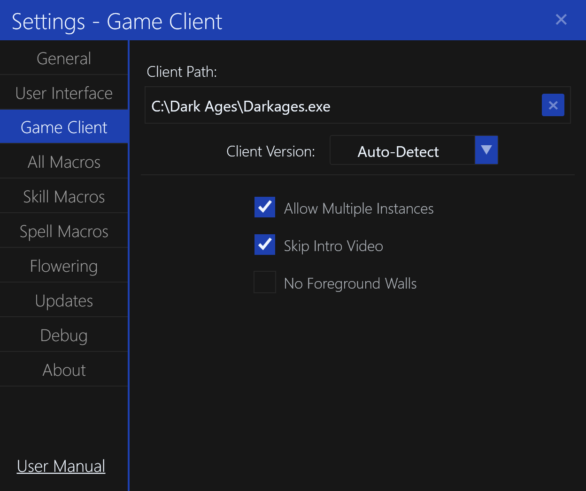

# Game Client Settings

The `Game Client` settings tab contains settings for the Dark Ages game client.

## Client Path

This setting determines the path to the Dark Ages game client executable.
It is also used to determine the path to the Dark Ages game client data files for rendering icons.

## Client Version

This setting determines the version of the Dark Ages game client and how any runtime patches should be applied.
The default is `Auto-Detect` and will automatically detect the version of the Dark Ages game client based on the executable MD5 hash.

You should not change this unless you are using a custom Dark Ages game client.

## DirectDraw Compatibility Fix

This setting will copy a patched `ddraw.dll` from the [DDrawCompat](https://github.com/narzoul/DDrawCompat) repo into the client folder.
By default this is `Enabled` for x86/x64 operating systems.

This fixes the flickering mouse cursor issue on modern computers.

## Allow Multiple Instances

This setting determines when the "multiple instances" patch should be applied when the Dark Ages game client is started.
By default, this is `Enabled`.

## Skip Intro Video

This setting determines when the "skip intro video" patch should be applied when the Dark Ages game client is started.
By default, this is `Enabled`.

## No Foreground Walls

This setting determines when the "no foreground walls" patch should be applied when the Dark Ages game client is started.
By default, this is `Disabled`.

This is useful when trying to find items that are hidden behind walls.
