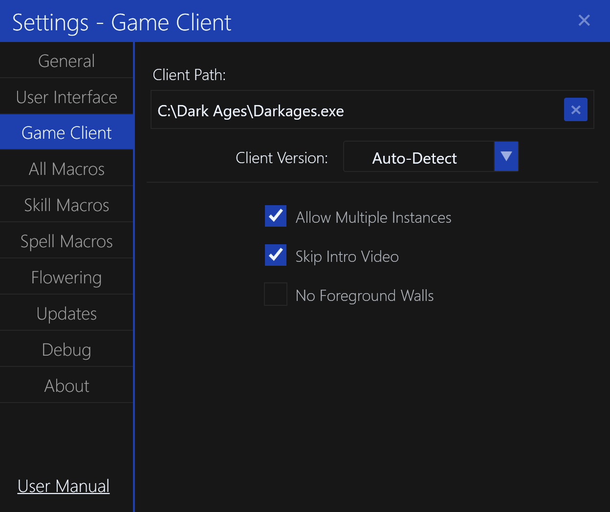

# Game Client Settings

The `Game Client` settings tab contains settings for the Dark Ages game client.

## Client Path

This setting determines the path to the Dark Ages game client executable.
It is also used to determine the path to the Dark Ages game client data files for rendering icons.

## Client Version

This setting determines the version of the Dark Ages game client and how any runtime patches should be applied.
The default is `Auto-Detect` and will automatically detect the version of the Dark Ages game client based on the client signature.

You should not change this unless you are using a custom Dark Ages game client.

Runtime patches are applied only when SleepHunter launches a new client. Changing these settings does not modify clients that are already running.
Each patch is applied only when the detected client version declares support for it. SleepHunter verifies the client before applying runtime hooks and terminates the suspended launch if a required verification or patch fails, rather than starting a partially patched client.

## Allow Multiple Instances

This setting determines when the "multiple instances" patch should be applied when the Dark Ages game client is started.
By default, this is `Enabled`.

## Skip Intro Video

This setting determines when the "skip intro video" patch should be applied when the Dark Ages game client is started.
By default, this is `Enabled`.

## Suppress Login Notification

This setting bypasses the login notification and its associated transfer delay when a supported Dark Ages game client is started.
By default, this is `Enabled`.

The setting has no effect for client versions that do not support the patch.

## Apply Modifiers Key Fix

This setting clears held keys and modifiers when a supported Dark Ages game client loses focus.
It prevents client hotkeys from becoming stuck when key-release events are sent to another window.

By default, this is `Enabled`.
The setting has no effect for client versions that do not support the patch.

## Show Ground Items with Alt

This setting lets you hold either Alt key to reveal up to 255 ground items as translucent hints, including items hidden behind static map art.
Releasing Alt returns the client to its normal rendering behavior.

By default, this is `Enabled`.
The patch also enables modifier cleanup on focus loss so the client cannot leave Alt stuck when focus changes.
The setting has no effect for client versions that do not support the patch.

## Show Item Quantities in Dialogs

This setting adds the current stack quantity in parentheses to item names in inventory-based merchant and storage dialogs when the quantity is greater than one.
Long item names are shortened with two dots when necessary so the quantity remains visible.

By default, this is `Enabled`.
The patch changes only the displayed label; it does not change the item, quantity, or server interaction.
The setting has no effect for client versions that do not support the patch.

## No Foreground Walls

This setting determines when the "no foreground walls" patch should be applied when the Dark Ages game client is started.
By default, this is `Disabled`.

This is useful when trying to find items that are hidden behind walls.
