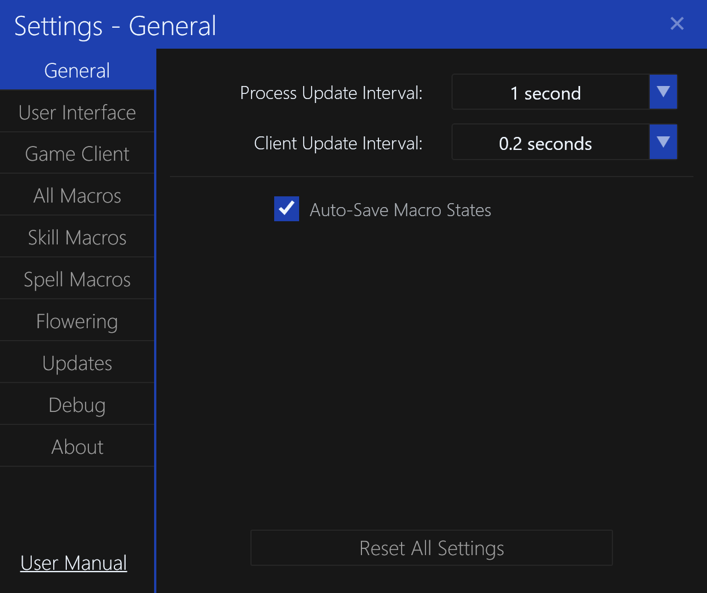

# General Settings

The `General` settings tab contains general settings for the application.

## Process Update Interval

The process update interval determines how often the application will check for new Dark Ages game client instances.

## Client Update Interval

The client update interval determines how often the application will read character state information from the Dark Ages game clients.

## Auto-Save Macro Stats

This setting will automatically save the macro stats for each character when the application is closed.
They will automatically be loaded when the application is started and that character is logged in.

## Reset All Settings

This button will reset all settings to their default values, and be applied instantly.

**NOTE:** User settings are automatically saved when the application is closed.
