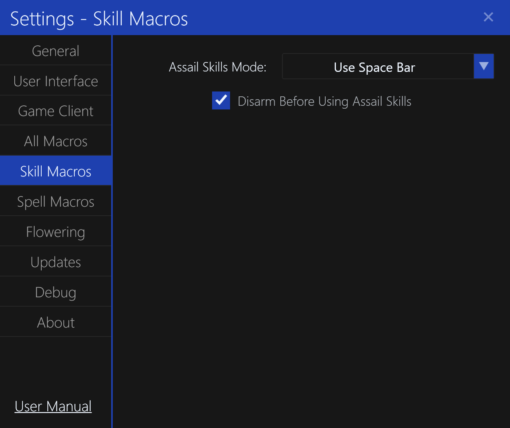

# Skill Macro Settings

The `Skill Macro Settings` settings tab contains settings for skill macros.

## Assail Skills Mode

This setting determines how the `Assail Skills` macro will performed.
By default, this is `Use Space Bar` which will perform all assails. Alternatively, they can be clicked individually.

## Disarm Before Using Assail Skills

This setting determines whether the character will automatically un-equip any weapons before using assail skills.
By default, this is `Enabled`.

This prevents unnecessary repairs to weapons when using assail skills.

**NOTE:** This setting is for historical purposes when certain sub-classes would not be able to re-equip certain weapons or staves from their previous class.
