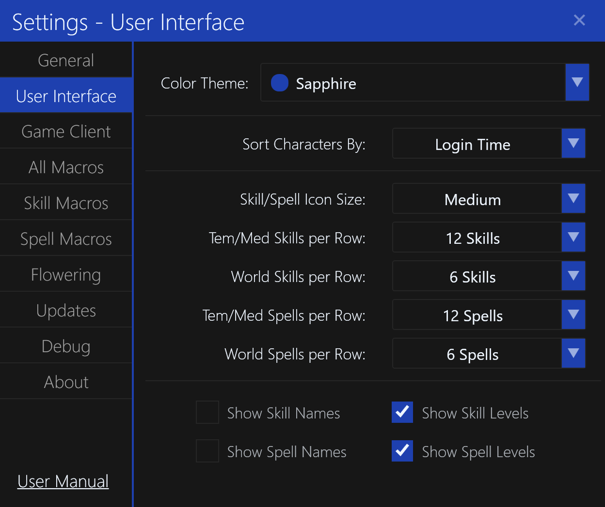

# User Interface Settings

The `User Interface` settings tab contains settings for the user interface.

## Color Theme

The color theme determines the color scheme used for the application.
The default is a blue `Sapphire` color.

## Sort Characters By

This setting determines how characters are sorted in the [Character List](../main-window/character-list.md).
By default, characters are sorted by their `Login Time` (oldest to newest).

The `Max Health & Mana` option will sort characters by their maximum health and mana, similar to the in-game list.
The total sort value is `Max HP + (Max MP * 2)`.

## Spell/Skill Icon Size

This setting determines the size of the spell and skill icons in the [Spells Tab](../main-window/spells-tab.md) and [Skills Tab](../main-window/skills-tab.md).
The default size is `Medium`.

## Tem/Med Skills Per Row

This setting determines how many skills are displayed per row in the [Skills Tab](../main-window/skills-tab.md) for Temuair and Medenian skills.
The default is `12`, similar to the game client.

## World Skills Per Row

This setting determines how many skills are displayed per row in the [Skills Tab](../main-window/skills-tab.md) for World skills.
The default is `6`, similar to the game client.

## Tem/Med Spells Per Row

This setting determines how many spells are displayed per row in the [Spells Tab](../main-window/spells-tab.md) for Temuair and Medenian spells.
The default is `12`, similar to the game client.

## World Spells Per Row

This setting determines how many spells are displayed per row in the [Spells Tab](../main-window/spells-tab.md) for World spells.
The default is `6`, similar to the game client.

## Show Skill Names

This setting determines whether skill names are displayed in the [Skills Tab](../main-window/skills-tab.md).
They are displayed underneath the skill icon.

By default, this is `Disabled`.

## Show Spell Names

This setting determines whether spell names are displayed in the [Spells Tab](../main-window/spells-tab.md).
They are displayed underneath the spell icon.

By default, this is `Disabled`.

## Show Skill Levels

This setting determines whether skill levels are displayed in the [Skills Tab](../main-window/skills-tab.md).
They are displayed in the bottom-right corner of the skill icon (if the skill can improve).

By default, this is `Enabled`.

## Show Spell Levels

This setting determines whether spell levels are displayed in the [Spells Tab](../main-window/spells-tab.md).
They are displayed in the bottom-right corner of the spell icon (if the spell can improve).

By default, this is `Enabled`.
