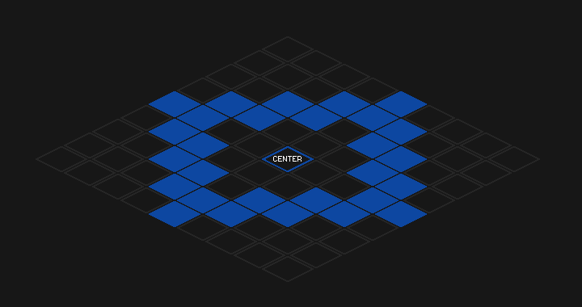

# Absolute Tile Area Target

This will cast the spell in an circular area around a location on the map, regardless of the character's current position.
The spell will be cast on the tiles in a clockwise order.

In the above example, the `Inner Radius` is set to **2**, and the `Outer Radius` is set to **4**.
The dead-zone is the area in the center of the circle, where no spells will be cast.
The solid blue tiles are the tiles that will be selected for casting the spell, in clockwise order.

This can be useful in some instances, such as periodically casting a spell on targets within an area without worrying about the character's current position.

## Options

- `Absolute Tile` - the tile on the map to cast the spell on. It is **not** relative to your character's current position. This will be the center of the circular region.
- `Inner Radius` - the inner radius of the circular region. This is the dead-zone, where no spells will be cast.
- `Outer Radius` - the outer radius of the circular region. This is the maximum distance from the center where spells will be cast.
- `Mouse Offset X/Y` - offsets the mouse screen coordinates by the specified amount.
- `Cast Spell Until Reaches` - sets the maximum level before this spell will no longer be cast in the [Spell Queue](../user-interface/main-window.md#spell-queue).
