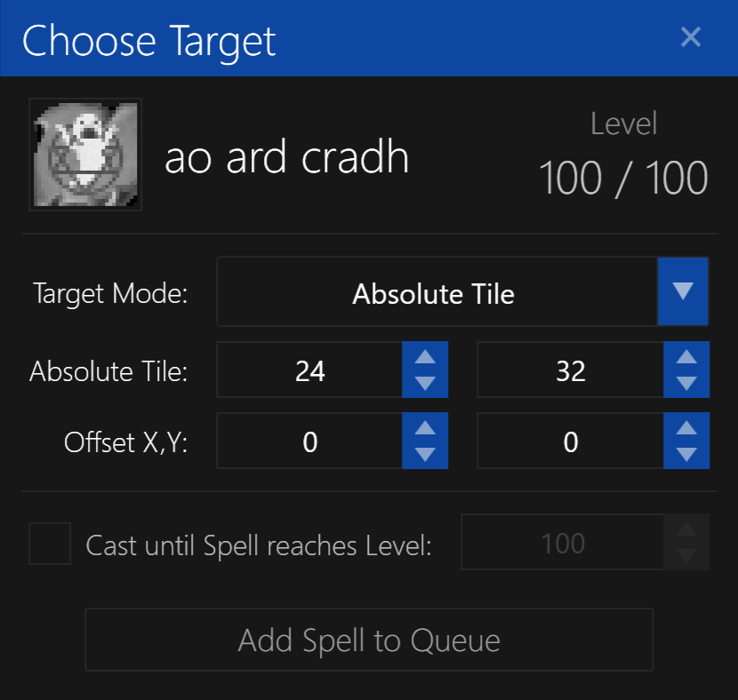

# Absolute Tile Target

This will cast the spell on a tile at a specific location on the map, regardless of the character's current position.

**NOTE:** You must be within visible range of the tile for the spell to be cast.

## Options

- `Absolute Tile` - the tile on the map to cast the spell on. It is **not** relative to your character's current position.
- `Mouse Offset X/Y` - offsets the mouse screen coordinates by the specified amount.
- `Cast Spell Until Reaches` - sets the maximum level before this spell will no longer be cast in the [Spell Queue](../user-interface/main-window.md#spell-queue).
