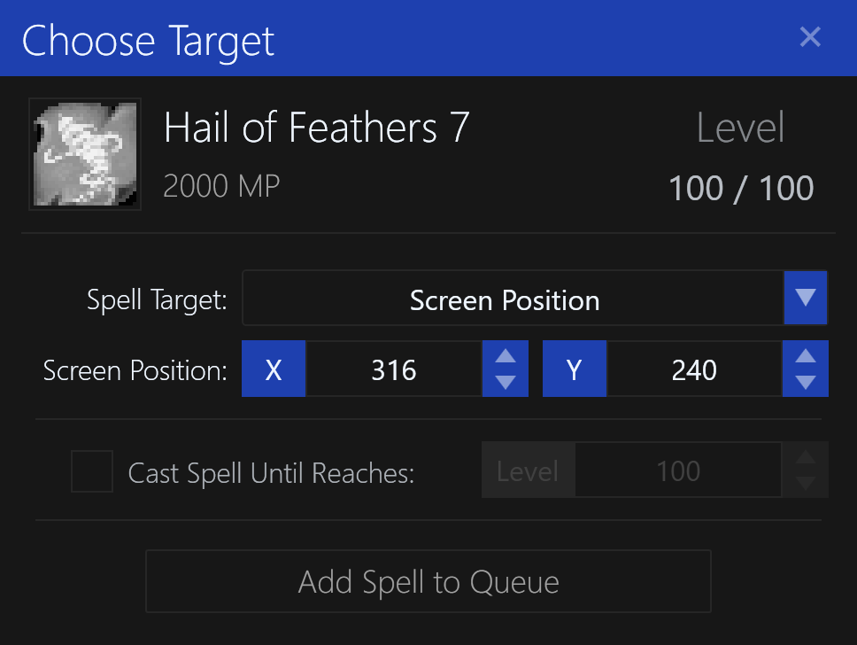

# Screen Position Target

This will cast the spell on a specific location on the screen, regardless of the character's current position.

The `Screen Position X/Y` is used to select the location on the screen to cast the spell on, in pixels.

## Options

- `Screen Position X/Y` - the screen coordinates to cast the spell on.
- `Cast Spell Until Reaches` - sets the maximum level before this spell will no longer be cast in the [Spell Queue](../user-interface/main-window.md#spell-queue).
