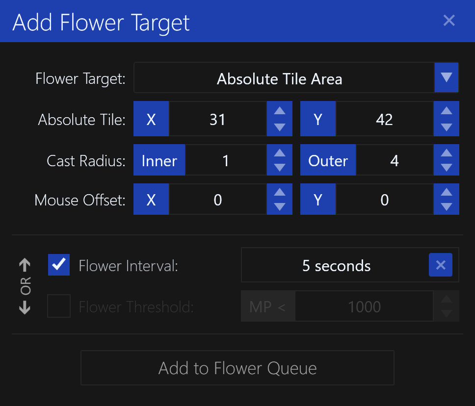
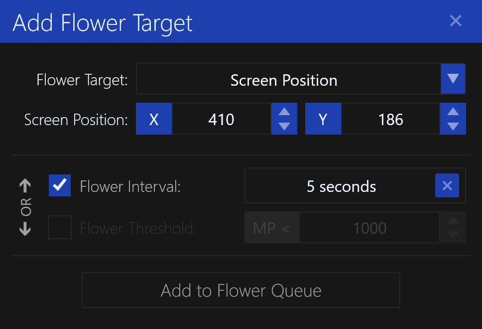

# Flower Target

The `Flower Target` dialog is used to select a target for casting `Lyliac Plant`, restoring mana.

It supports several different types of targets:

- [Alternate Character](#alternate-character)
- [Relative Tile](#relative-tile)
- [Relative Tile Area](#relative-tile-area)
- [Absolute Tile](#absolute-tile)
- [Absolute Tile Area](#absolute-tile-area)
- [Screen Position](#screen-position)

## Flower Conditions

In addition, you must specify the trigger conditions:

- `Flower Interval` - The minimum time between casting flower, can be specified in various time units including fractions of a second.
- `Flower Threshold` - The mana threshold for the other character, before casting flower on them. Can only be used with `Alternate Character` target type.

**NOTE:** These can be used together, but are evaluated as a logical `OR` condition.
Meaning, if **either** condition is met, the flower will be cast.

## Alternate Character

This will cast `Lyliac Plant` spell on another character logged in on the same computer.

**NOTE:** The other character must be within visible range of the character casting flower.

The `Character` specifies the other character you wish to cast the spell on.

The `Mouse Offset X/Y` is used to fine-tune the mouse screen coordinates, if needed.

## Relative Tile

This will cast `Lyliac Plant` on a tile relative to the character's current position.
For example, "4 Right, 3 Down" would be the tile located 4 tiles right and 3 tiles down of your character's current position.

This relative tile will be preserved even if the character moves to a different tile.

The `Relative Tile` is the tile relative to your character's current position.

The `Mouse Offset X/Y` is used to fine-tune the mouse screen coordinates, if needed.

## Relative Tile Area

This will cast `Lyliac Plant` in an circular area relative to the character's current position.
It will be cast on the tiles in a clockwise order.

In the above example, the `Inner Radius` is set to **2**, and the `Outer Radius` is set to **4**.
The dead-zone is the area in the center of the circle, where flower will **not** be cast.
The solid blue tiles are the tiles that will be selected for casting flower, in clockwise order.

The `Relative Tile` is the tile relative to your character's current position. This will be the center of the circular region.

The `Inner Radius` is used to select the dead-zone, where flower will **not** be cast.
Use **Zero (0)** to disable the dead-zone and include the center tile, turning it into a solid circle.

The `Outer Radius` is used to select the outer radius of the circle. This is the maximum distance from the center flower will be cast.
This value must be greater than the `Inner Radius`.

The `Mouse Offset X/Y` is used to fine-tune the mouse screen coordinates, if needed.

This can be useful in some instances, such as periodically flowering a group of characters without worrying about their position.

## Absolute Tile

This will cast `Lyliac Plant` on a tile at a specific location on the map, regardless of the character's current position.

**NOTE:** You must be within visible range of the tile for the spell to be cast.

The `Absolute Tile` is the tile on the map to cast flower on. It is not relative to your character's current position.

The `Offset X/Y` is used to fine-tune the mouse screen coordinates, if needed.

## Absolute Tile Area

This will cast `Lyliac Plant` in an circular area around a location on the map, regardless of the character's current position.
It will be cast on the tiles in a clockwise order.

In the above example, the `Inner Radius` is set to **2**, and the `Outer Radius` is set to **4**.
The dead-zone is the area in the center of the circle, where flower will **not** be cast.
The solid blue tiles are the tiles that will be selected for casting flower, in clockwise order.

The `Absolute Tile` is used to select the tile on the map. This will be the center of the circular region.
It is not relative to your character's current position.

The `Inner Radius` is used to select the dead-zone, where flower will **not** be cast.
Use **Zero (0)** to disable the dead-zone and include the center tile, turning it into a solid circle.

The `Outer Radius` is used to select the outer radius of the circle. This is the maximum distance from the center flower will be cast.
This value must be greater than the `Inner Radius`.

The `Offset X/Y` is used to fine-tune the mouse screen coordinates, if needed.

This can be useful in some instances, such as periodically casting flower on targets within an area without worrying about the character's current position.

## Screen Position

This will cast `Lyliac Plant` on a specific location on the screen, regardless of the character's current position.

The `Screen Position X/Y` is used to select the location on the screen to cast flower on, in pixels.
