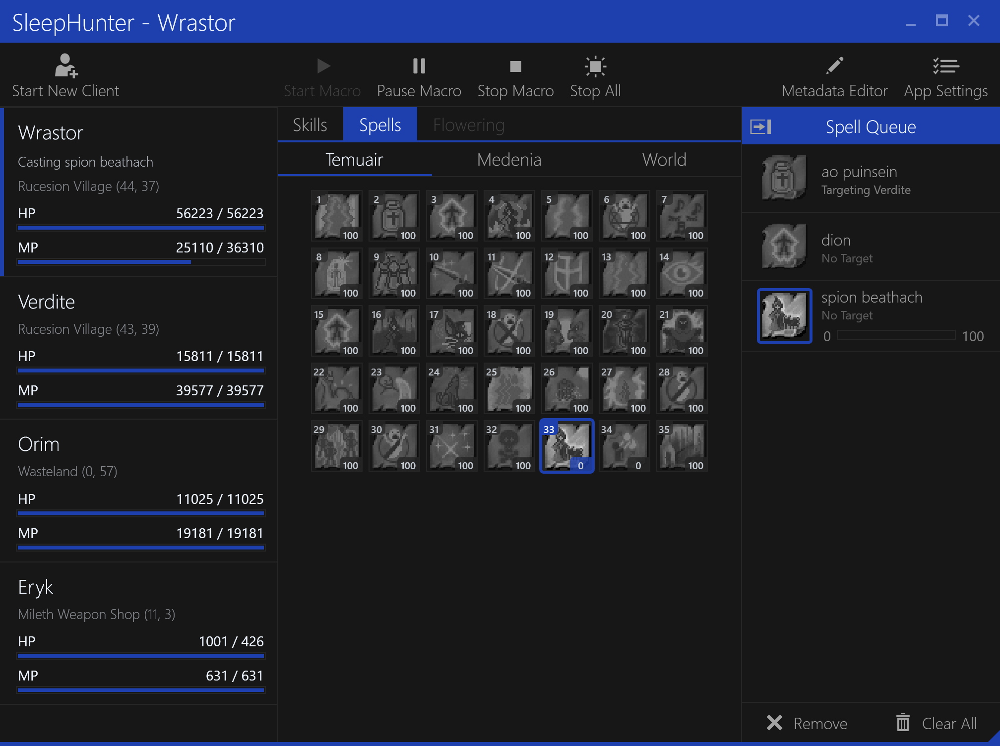
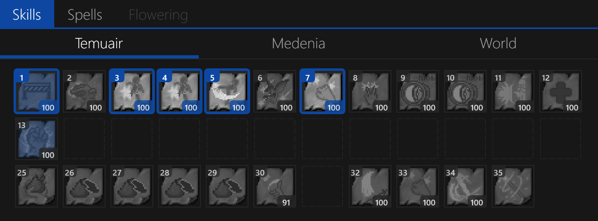

# Main Window

The main window of SleepHunter is where you will spend most of your time.
In most cases, you can mouse over any element in the window to get a tooltip with more information.

It is divided into main sections:

- [Toolbar](#toolbar) buttons allow new game clients to be started, starting and stopping macroing, and accessing the [Settings](./settings.md) window.
- [Character List](#character-list) shows all characters that are currently logged in and their status.
- [Abilities](#abilities)
  - [Skills Tab](#skills-tab) shows all skills that are currently available for macroing.
  - [Spells Tab](#spells-tab) shows all spells that are currently available for macroing.
  - [Flowering Tab](#flowering-tab) shows targets for casting `Lyliac Plant` and `Lyliac Vineyard`.
- [Spell Queue](#spell-queue) shows all spells that have been added to the queue for macroing.
- [Status Bar](#status-bar) - Unused, provides a way to resize the window on the bottom-right corner.

The `Skills` and `Spells` tabs are also divided into sections for `Temuair`, `Medenia` and `World` abilities.
These correspond to the three different skill and spell panels in the game client.

## Toolbar

The toolbar has the following buttons:

- `Start New Client` - Launches a new game client, applying any tweaks that are enabled in the [Settings](./settings.md#game-client) window.
- `Start Macroing` - Starts macroing the selected character.
- `Pause Macroing` - Pauses macroing the selected character.
- `Stop Macroing` - Stops macroing the selected character.
- `Settings` - Opens the [Settings](./settings.md) window.

The main difference between `Pause Macroing` and `Stop Macroing` is that pause acts as a temporary stop, while stop will reset the macro state for that character.
This does **not** mean that your skills and spells will be removed from the queue, only that the macro state will be reset.

In most cases these are equivalent, so you can use either one depending on your preference.

## Character List

Shows information about the character, including current location, health, mana, and activity status (when macroing).
The selected character will be displayed with a highlighted indicator on the left side of the list item.

The main window title will also display the name of the selected character.

Double-clicking on a character will bring that Dark Ages game client window to the foreground.
This is useful when you are trying to find that particular game client window that is hidden behind other windows.

You can also bind a hotkey combination to a character by selecting the character and pressing the hotkey combination (ex: `Ctrl+1`).
This will act as a global hotkey that can be used to pause/resume macroing for that particular character.

If a hotkey is bound to a character, the hotkey combination will be displayed in the character window.
You can unbind a hotkey by selecting the character and pressing the `Delete` or `Backspace` key.

**NOTE:** Binding the same hotkey combination to another character will unbind it from the previous character.

## Abilities

The selected character's abilities are divided into tabs: `Skills`, `Spells` and `Flowering`.

These are separated into sections for `Temuair`, `Medenia` and `World` abilities.

**NOTE:** If a character does not have `Lyliac Plant` or `Lyliac Vineyard` available, the `Flowering` tab will be disabled for that character.

### Skills Tab

Skills are arranged as a grid of icon buttons similar to the game client, displaying the current level of the skill and the cooldown status (if on cooldown).

Double-clicking a skill will toggle it on or off for macroing.
When a skill is "enabled" for macroing, the icon will be highlighted white and a thick border will be displayed around the skill.

You can mouse over a skill to see the tooltip for that skill.

### Spells Tab

Spells are arranged as a grid of icon buttons similar to the game client, displaying the current level of the spell and the cooldown status (if on cooldown).

Double-clicking a spell will bring up the [Spell Target](./spell-target.md) dialog for that casting spell.
This dialog allows you to select a target for the spell and add it to the [Spell Queue](#spell-queue).

You can mouse over a spell to see the tooltip for that spell.

### Flowering Tab

## Spell Queue

## Status Bar