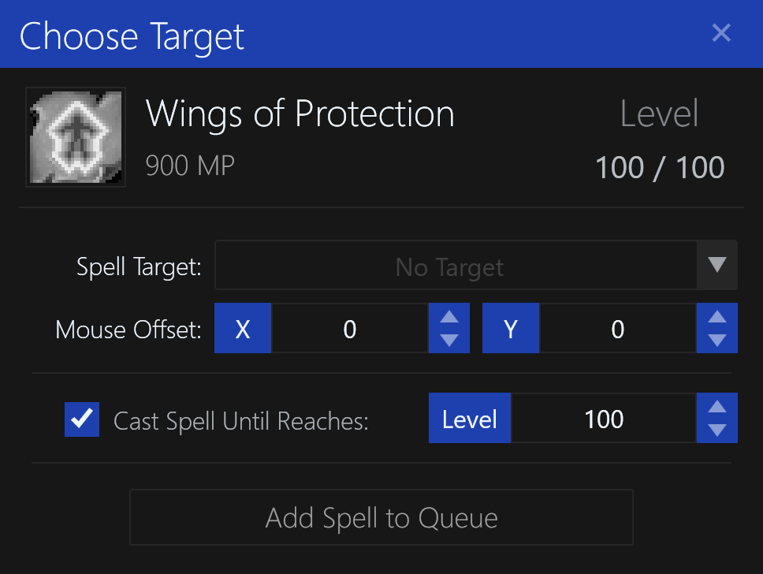
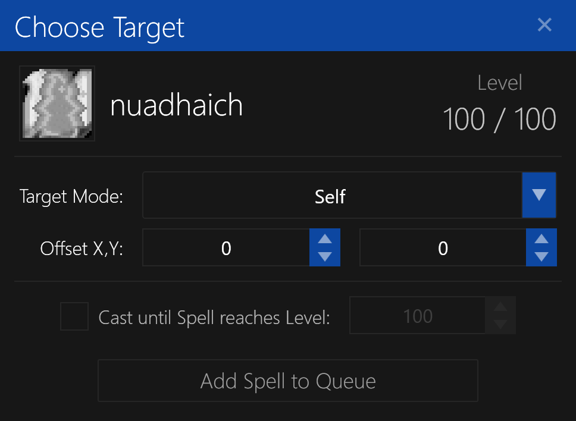
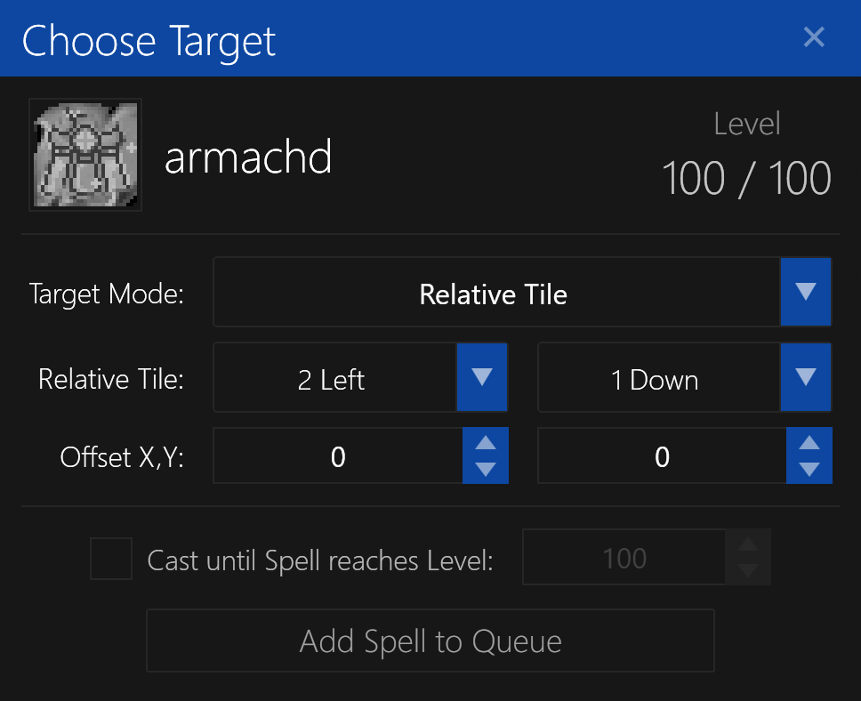

# Spell Target

The `Spell Target` dialog is used to select a target for casting a spell.

It supports several different types of targets:

- [No Target](#no-target)
- [Self](#self)
- [Alternate Character](#alternate-character)
- [Relative Tile](#relative-tile)
- [Relative Tile Area](#relative-tile-area)
- [Absolute Tile](#absolute-tile)
- [Absolute Tile Area](#absolute-tile-area)
- [Screen Position](#screen-position)

This may seem like a lot of options, but it's actually quite simple. See each section below for more information.

## No Target

This is used when a spell does not require a target, such as a self-only or group spell.

**NOTE:** This option cannot be selected, it is automatically selected when the spell does not require a target.

## Self

This will cast the spell on yourself as the target.

The `Mouse Offset X/Y` is used to fine-tune the mouse screen coordinates, if needed.

**NOTE:** The older `Relative Coordinates` target type has been replaced with this new `Offset X/Y` target type on `Self`, as it was redundant.

## Alternate Character

This will cast the spell on another character logged in on the same computer.

**NOTE:** The other character must be within visible range of the character casting the spell.

The `Character` specifies the other character you wish to cast the spell on.

The `Mouse Offset X/Y` is used to fine-tune the mouse screen coordinates, if needed.

## Relative Tile

This will cast the spell on a tile relative to the character's current position.
For example, "2 Left, 1 Down" would be the tile located 2 tiles left and 1 tile down of your character's current position.

This relative tile will be preserved even if the character moves to a different tile.

The `Relative Tile` is the tile relative to your character's current position.

The `Mouse Offset X/Y` is used to fine-tune the mouse screen coordinates, if needed.

## Relative Tile Area

This will cast the spell in an circular area relative to the character's current position.
The spell will be cast on the tiles in a clockwise order.

In the above example, the `Inner Radius` is set to **2**, and the `Outer Radius` is set to **4**.
The dead-zone is the area in the center of the circle, where no spells will be cast.
The solid blue tiles are the tiles that will be selected for casting the spell, in clockwise order.

The `Relative Tile` is the tile relative to your character's current position. This will be the center of the circular region.

The `Inner Radius` is used to select the dead-zone, where no spells will be cast.
Use **Zero (0)** to disable the dead-zone and include the center tile, turning it into a solid circle.

The `Outer Radius` is used to select the outer radius of the circle. This is the maximum distance from the center where spells will be cast.
This value must be greater than the `Inner Radius`.

The `Mouse Offset X/Y` is used to fine-tune the mouse screen coordinates, if needed.

This can be useful in some instances, such as periodically casting a spell on targets within an area without knowing their exact location.

## Absolute Tile

This will cast the spell on a tile at a specific location on the map, regardless of the character's current position.

**NOTE:** You must be within visible range of the tile for the spell to be cast.

The `Absolute Tile` is the tile on the map to cast the spell on. It is not relative to your character's current position.

The `Offset X/Y` is used to fine-tune the mouse screen coordinates, if needed.

## Absolute Tile Area

This will cast the spell in an circular area around a location on the map, regardless of the character's current position.
The spell will be cast on the tiles in a clockwise order.

In the above example, the `Inner Radius` is set to **2**, and the `Outer Radius` is set to **4**.
The dead-zone is the area in the center of the circle, where no spells will be cast.
The solid blue tiles are the tiles that will be selected for casting the spell, in clockwise order.

The `Absolute Tile` is used to select the tile on the map. This will be the center of the circular region.
It is not relative to your character's current position.

The `Inner Radius` is used to select the dead-zone, where no spells will be cast.
Use **Zero (0)** to disable the dead-zone and include the center tile, turning it into a solid circle.

The `Outer Radius` is used to select the outer radius of the circle. This is the maximum distance from the center where spells will be cast.
This value must be greater than the `Inner Radius`.

The `Offset X/Y` is used to fine-tune the mouse screen coordinates, if needed.

This can be useful in some instances, such as periodically casting a spell on targets within an area without worrying about the character's current position.

## Screen Position

This will cast the spell on a specific location on the screen, regardless of the character's current position.

The `Screen Position X/Y` is used to select the location on the screen to cast the spell on, in pixels.
